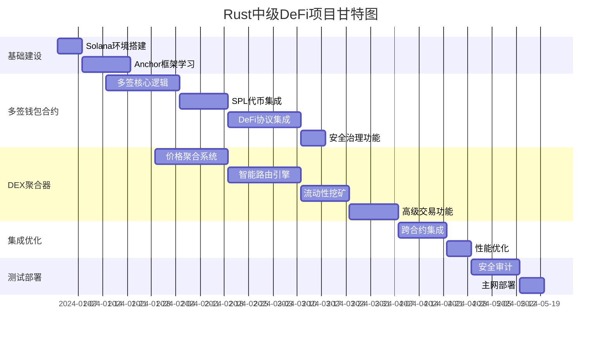

# 🦀 Rust中级DeFi智能合约实战项目 - 总体规划路线图

## 📋 项目总览

**项目目标**: 通过2个核心Solana DeFi智能合约达到Rust中级开发水平  
**技术领域**: Solana DeFi生态系统完整解决方案  
**总周期**: 12-16周 (约3-4个月)  
**团队规模**: 6-10人Solana专业团队  
**总预算**: $800K - $1.2M

---

## 🎯 双项目协同战略

### **项目组合价值**
- **技术协同**: 共享Anchor框架、SPL Token操作和跨程序调用技术
- **生态协同**: 多签钱包用户可无缝使用DEX聚合器功能
- **数据协同**: 价格数据和用户行为数据在项目间共享
- **市场协同**: 构建完整的Solana DeFi基础设施品牌

### **Solana生态定位策略**
- **差异化定位**: 安全钱包 + 智能交易的Solana原生解决方案
- **目标市场**: Solana DeFi用户、DAO组织、机构投资者
- **竞争优势**: 基于Solana高性能优势的原生体验

---

## 📊 项目优先级与技术依赖

### **项目执行策略: 技能递进，功能协同**



### **技术依赖关系**
1. **共享基础**: 两项目共用Anchor框架、SPL Token集成技术
2. **数据接口**: DEX聚合器为钱包提供价格数据API
3. **用户认证**: 统一的钱包身份验证和权限系统
4. **合约交互**: 钱包可直接调用DEX聚合器进行交易

---

## 🏗️ 分阶段执行计划

### **阶段一: Solana基础掌握 (第1-3周)**

#### **Solana生态学习与环境建设**
```yaml
目标: 建立完整的Solana开发基础和团队能力
关键任务:
  - [ ] Solana CLI和开发工具熟练掌握
  - [ ] Anchor框架深度学习和实践
  - [ ] SPL Token Program理解和应用
  - [ ] PDA和CPI机制深度掌握
  
交付物:
  - ✅ 完整的Solana开发环境
  - ✅ Anchor框架最佳实践规范
  - ✅ Solana账户模型理解文档
  - ✅ 团队技能评估和培训计划

技术能力建设:
  - Solana账户模型和程序架构理解
  - Anchor框架开发模式掌握
  - 跨程序调用(CPI)设计和实现
  - Solana开发和测试最佳实践

预算投入: $80K
  - 团队培训和顾问费用: $50K
  - 开发工具和基础设施: $20K
  - 学习资源和材料: $10K
```

### **阶段二: 多签钱包合约开发 (第4-11周)**

#### **Week 4-6: 多签核心逻辑实现 (3周)**
```yaml
负责团队: Solana智能合约开发团队A (3人)
技术重点: Anchor框架深度应用 + 多签安全机制

Week 4: 项目架构和账户设计
  - [ ] Anchor项目结构搭建
  - [ ] 核心账户结构设计(MultisigWallet, Transaction)
  - [ ] PDA地址生成策略
  - [ ] 基础权限验证框架

Week 5: 多签逻辑实现
  - [ ] 钱包初始化和配置
  - [ ] 交易提案创建和管理
  - [ ] 签名收集和验证机制
  - [ ] 交易执行和状态管理

Week 6: 安全机制完善
  - [ ] 重放攻击防护
  - [ ] 权限提升防护
  - [ ] 紧急暂停机制
  - [ ] 单元测试和安全测试

技术挑战:
  - Anchor约束和验证机制
  - PDA种子设计和冲突避免
  - 多签状态管理优化
  - Gas费用和存储优化
```

#### **Week 7-8: SPL代币集成管理 (2周)**
```yaml
负责团队: Solana智能合约开发团队A + Token专家
技术重点: SPL Token Program深度集成

Week 7: 基础代币操作
  - [ ] SOL转账功能实现
  - [ ] SPL代币转账集成
  - [ ] 关联代币账户(ATA)管理
  - [ ] 代币余额查询优化

Week 8: 高级代币功能
  - [ ] 批量转账实现和优化
  - [ ] 代币元数据集成
  - [ ] 多币种混合操作
  - [ ] 转账失败回滚机制

技术挑战:
  - CPI调用SPL Token Program
  - 批量操作指令大小限制
  - 账户租金优化策略
  - 错误处理和状态恢复
```

#### **Week 9-11: DeFi协议集成层 (3周)**
```yaml
负责团队: DeFi协议专家 + 智能合约团队A
技术重点: 主流Solana DeFi协议集成

Week 9: Serum DEX集成
  - [ ] Serum市场交易功能
  - [ ] OpenOrders账户管理
  - [ ] 订单创建和执行
  - [ ] 价格查询和滑点保护

Week 10: Raydium和Orca集成
  - [ ] Raydium AMM流动性操作
  - [ ] Orca集中流动性管理
  - [ ] LP代币管理和奖励收获
  - [ ] 无常损失计算

Week 11: 其他协议和优化
  - [ ] Mango Markets借贷集成
  - [ ] Solend协议操作
  - [ ] 协议间资产迁移
  - [ ] 风险管理和监控

技术挑战:
  - 复杂CPI调用链设计
  - 多协议状态同步
  - 协议版本兼容性
  - 跨协议错误处理
```

#### **Week 12: 安全治理功能 (1周)**
```yaml
负责团队: 安全专家 + 治理设计师
技术重点: 企业级安全和治理机制

关键交付:
  - [ ] 时间锁(Timelock)机制实现
  - [ ] 程序升级治理流程
  - [ ] 参数管理和投票系统
  - [ ] 审计日志和监控

安全审查重点:
  - 权限控制完整性验证
  - 时间锁延迟机制测试
  - 治理攻击向量分析
  - 紧急响应流程验证
```

### **阶段三: DEX聚合器合约开发 (第6-13周)**

#### **Week 6-8: 多DEX价格聚合器 (3周)**
```yaml
负责团队: 智能合约开发团队B (3人) + 算法工程师
技术重点: 实时价格聚合和流动性分析

Week 6: 单一DEX价格查询
  - [ ] Serum订单簿价格查询
  - [ ] Raydium AMM价格计算
  - [ ] Orca集中流动性价格
  - [ ] 基础价格比较框架

Week 7: 多DEX聚合系统
  - [ ] 统一价格查询接口
  - [ ] 价格标准化和比较
  - [ ] 流动性深度分析
  - [ ] 异常价格检测过滤

Week 8: 价格影响计算
  - [ ] 大额交易滑点预测
  - [ ] 交易成本综合计算
  - [ ] 价格影响数学模型
  - [ ] 实时数据缓存优化

技术挑战:
  - 不同DEX类型价格标准化
  - 大额交易影响精确建模
  - 实时数据更新性能优化
  - 异常情况处理和恢复
```

#### **Week 9-11: 智能路由执行引擎 (3周)**
```yaml
负责团队: 算法工程师 + 智能合约团队B
技术重点: 最优路径算法和交易执行

Week 9: 路径搜索算法
  - [ ] 单跳和多跳路径发现
  - [ ] Dijkstra算法优化实现
  - [ ] 路径权重动态调整
  - [ ] 路径缓存和性能优化

Week 10: 交易执行引擎
  - [ ] 原子交易执行框架
  - [ ] 分片交易策略实现
  - [ ] 滑点保护和失败回滚
  - [ ] 并行执行协调机制

Week 11: MEV保护机制
  - [ ] 交易时序保护设计
  - [ ] MEV检测和预警
  - [ ] 私有执行路径实现
  - [ ] 损失补偿计算模型

技术挑战:
  - 复杂路径搜索算法优化
  - 原子性和一致性保证
  - MEV攻击检测和防护
  - 高频执行性能要求
```

#### **Week 12-13: 流动性挖矿聚合器 (2周)**
```yaml
负责团队: DeFi策略专家 + 智能合约团队B
技术重点: 收益优化和自动化策略

Week 12: 收益策略引擎
  - [ ] 多协议收益率比较
  - [ ] 风险调整收益计算
  - [ ] 策略选择优化算法
  - [ ] 自动化执行框架

Week 13: 动态优化功能
  - [ ] 自动复投机制实现
  - [ ] 动态再平衡策略
  - [ ] 用户偏好适配算法
  - [ ] 收益历史跟踪分析

技术挑战:
  - 多目标优化算法设计
  - 实时策略调整机制
  - 复投成本效益分析
  - 风险评估模型精确性
```

#### **Week 14: 高级交易功能 (1周)**
```yaml
负责团队: 量化交易专家 + 全栈开发团队
技术重点: 专业交易工具和套利功能

关键交付:
  - [ ] 限价单和止损单系统
  - [ ] DCA定投策略自动化
  - [ ] 闪电贷套利功能
  - [ ] 条件订单监控执行

高级功能特色:
  - 网格交易策略实现
  - 套利机会自动识别
  - 风险管理工具集成
  - 专业API接口完善
```

### **阶段四: 系统集成与优化 (第14-16周)**

#### **Week 14-15: 跨合约集成开发**
```yaml
目标: 实现钱包和DEX聚合器的深度集成
关键任务:
  - [ ] 统一用户身份认证系统
  - [ ] 钱包内一键DEX交易功能
  - [ ] 跨合约状态同步机制
  - [ ] 集成错误处理和恢复

技术挑战:
  - 跨合约调用性能优化
  - 状态一致性保证
  - 用户体验无缝衔接
  - 集成测试覆盖度

Week 15: 性能优化与Gas优化
  - [ ] 智能合约指令优化
  - [ ] 计算单元(CU)消耗减少
  - [ ] 账户布局和存储优化
  - [ ] 批量操作性能调优
```

#### **Week 16: 安全审计与上线准备**
```yaml
目标: 确保系统安全性达到生产标准
关键任务:
  - [ ] 专业安全审计执行
  - [ ] 漏洞修复和验证
  - [ ] 主网部署准备
  - [ ] 运营监控系统搭建

安全审计重点:
  - 智能合约代码安全审查
  - 跨程序调用安全验证
  - 权限控制完整性检查
  - 经济模型安全分析
```

---

## 💰 资源分配与预算规划

### **人力资源配置**
```yaml
核心开发团队 (8人):
  项目管理:
    - 技术项目经理 × 1
    - Solana架构师 × 1
  
  智能合约开发:
    - 高级Rust开发工程师 × 2
    - Anchor框架专家 × 1
    - Solana DeFi协议专家 × 1
  
  算法和策略:
    - 算法工程师 × 1
    - DeFi策略分析师 × 1

产品与设计团队 (3人):
  产品管理:
    - 产品经理 × 1 (John - 当前PM)
  
  用户体验:
    - 区块链UI/UX设计师 × 1
    - 前端开发工程师 × 1

专家顾问团队 (3人):
  - Solana生态安全审计专家 × 1
  - Solana DeFi生态顾问 × 1
  - 量化交易策略顾问 × 1
```

### **预算详细分解**
```yaml
人力成本 (16周): $640K
  - 核心技术团队: $480K
  - 产品设计团队: $80K
  - 专家顾问费用: $80K

基础设施成本: $48K
  - Solana RPC节点服务: $24K
  - 开发和测试环境: $12K
  - 监控和分析工具: $12K

审计与合规: $80K
  - Solana智能合约安全审计: $60K
  - 代码质量第三方评估: $20K

运营与推广: $100K
  - Solana社区建设: $40K
  - 技术文档和教程: $30K
  - 开发者生态推广: $30K

应急储备 (10%): $87K

总预算: $955K
```

---

## 📈 风险管理与应急预案

### **关键风险识别**

#### **技术风险 (高)**
```yaml
风险1: Anchor框架学习曲线陡峭
  概率: 高 (70%)
  影响: 中 (开发延期2-4周)
  缓解措施:
    - 团队提前培训和认证
    - Solana生态专家顾问支持
    - 分阶段技能验证考核
    - 外部培训资源投入

风险2: 复杂CPI调用链开发困难
  概率: 中 (50%)
  影响: 高 (功能实现受限)
  缓解措施:
    - 分阶段CPI集成验证
    - 简化初版功能范围
    - 专家代码审查支持
    - 充分的测试验证
```

#### **生态风险 (中)**
```yaml
风险3: Solana网络稳定性问题
  概率: 中 (40%)
  影响: 中 (开发测试受影响)
  缓解措施:
    - 多环境测试策略
    - 本地测试集群部署
    - 与Solana Labs保持沟通
    - 备用测试网络准备

风险4: DeFi协议快速迭代升级
  概率: 高 (80%)
  影响: 低 (集成维护成本)
  缓解措施:
    - 适配器模式设计
    - 版本兼容性预留
    - 协议更新监控机制
    - 灵活的升级策略
```

#### **团队风险 (中)**
```yaml
风险5: Solana专业人才稀缺
  概率: 中 (40%)
  影响: 高 (项目执行能力)
  缓解措施:
    - 提前人才储备和培养
    - 有竞争力的薪酬包
    - 远程工作灵活政策
    - 与Solana社区合作

风险6: 技术复杂度超预期
  概率: 中 (50%)
  影响: 中 (进度和质量影响)
  缓解措施:
    - 渐进式复杂度提升
    - MVP优先开发策略
    - 外部技术咨询支持
    - 灵活的范围调整
```

### **应急预案**

#### **技术应急预案**
```yaml
场景1: Anchor框架重大问题
  响应流程:
    1. 评估问题影响范围 (0-4小时)
    2. 联系Solana Labs技术支持 (4-8小时)
    3. 寻找替代技术方案 (8-24小时)
    4. 调整开发计划和架构 (1-3天)
    5. 团队技术培训更新 (3-7天)

场景2: 关键协议集成失败
  响应流程:
    1. 问题定位和根因分析 (0-2小时)
    2. 联系协议团队技术支持 (2-8小时)
    3. 实现备用集成方案 (8-48小时)
    4. 测试验证和文档更新 (2-5天)
    5. 经验总结和流程优化 (5-7天)
```

#### **项目管理应急预案**
```yaml
场景3: 关键人员离职
  响应流程:
    1. 知识转移和文档整理 (立即)
    2. 内部人员调配和培训 (1-2周)
    3. 外部专家临时支持 (2-4周)
    4. 长期人员招聘替换 (4-8周)
    5. 团队稳定性措施强化 (持续)

场景4: 项目范围大幅调整
  响应流程:
    1. 重新评估项目优先级和ROI
    2. 与利益相关者重新对齐
    3. 调整资源分配和时间计划
    4. 简化或延期非核心功能
    5. 更新项目文档和预期
```

---

## 🎯 成功标准与验收指标

### **项目整体成功指标**

#### **技术成功指标**
```yaml
代码质量:
  - Rust代码测试覆盖率 ≥ 85%
  - Anchor程序安全审计零高危漏洞
  - 跨程序调用成功率 ≥ 99%
  - 计算单元(CU)优化效果 ≥ 30%

功能完成度:
  - P0功能完成率 = 100%
  - P1功能完成率 ≥ 80%
  - Solana主流DeFi协议集成 ≥ 6个
  - 用户操作流程验证通过率 ≥ 95%

系统质量:
  - Devnet部署成功率 = 100%
  - 交易执行成功率 ≥ 99%
  - 响应时间满足性能要求
  - 系统可用性 ≥ 99.9%
```

#### **业务成功指标**
```yaml
用户指标:
  - 多签钱包部署数量 ≥ 100个
  - DEX聚合器日交易笔数 ≥ 500笔
  - 开发者SDK下载量 ≥ 1000次
  - 社区技术文档访问量 ≥ 5000次

交易指标:
  - 多签钱包管理资产 ≥ $2M
  - DEX聚合器日交易量 ≥ $5M
  - 交易成本优化效果 ≥ 15%
  - 平均交易确认时间 < 3秒

生态指标:
  - Solana社区认知度提升
  - 技术博客和案例分享
  - 开源贡献和社区反馈
  - 与其他项目的集成合作
```

#### **学习目标达成指标**
```yaml
技能提升:
  - 团队Rust智能合约能力达到中级
  - 掌握Anchor框架深度应用
  - 具备复杂CPI调用设计能力
  - 理解Solana DeFi生态架构

项目经验:
  - 完成完整Solana DeFi产品周期
  - 积累智能合约安全开发经验
  - 获得Solana生态深度认知
  - 建立Solana开发者网络

知识沉淀:
  - 形成Solana开发最佳实践
  - 建立可复用的技术组件库
  - 沉淀DeFi协议集成经验
  - 培养持续学习和创新文化
```

---

## 🚀 项目交付与生态建设

### **交付物清单**

#### **技术交付物**
```yaml
智能合约系统:
  - [ ] Solana多签钱包智能合约
  - [ ] Solana DEX聚合器智能合约
  - [ ] 共享Anchor组件库
  - [ ] 智能合约部署脚本
  - [ ] 合约升级和治理机制

SDK和工具:
  - [ ] TypeScript/JavaScript SDK
  - [ ] Python SDK (可选)
  - [ ] CLI工具和脚本
  - [ ] 开发者示例和模板
  - [ ] 测试和调试工具

前端应用:
  - [ ] 多签钱包Web应用
  - [ ] DEX聚合器交易界面
  - [ ] 管理后台和监控面板
  - [ ] 移动端适配 (可选)
  - [ ] 开发者文档网站
```

#### **文档交付物**
```yaml
技术文档:
  - [ ] Solana智能合约架构设计
  - [ ] Anchor程序开发指南
  - [ ] DeFi协议集成手册
  - [ ] API和SDK使用文档
  - [ ] 部署和运维指南

开发者资源:
  - [ ] 快速开始教程
  - [ ] 代码示例和最佳实践
  - [ ] 常见问题和故障排除
  - [ ] 视频教程和技术分享
  - [ ] 社区贡献指南

商业文档:
  - [ ] 产品白皮书
  - [ ] 技术路线图
  - [ ] 商业模式分析
  - [ ] 竞争分析报告
  - [ ] 投资者演示材料
```

### **Solana生态贡献**

#### **开源贡献计划**
```yaml
核心组件开源:
  - 发布核心智能合约代码
  - 开源SDK和开发工具
  - 贡献Anchor生态组件
  - 分享最佳实践案例

社区建设:
  - 技术博客和教程发布
  - Solana开发者聚会参与
  - 技术会议演讲分享
  - 在线技术问答支持

生态合作:
  - 与其他Solana项目集成
  - 参与Solana黑客松活动
  - 支持新开发者项目
  - 推动标准和规范制定
```

---

## 📊 项目总结与后续规划

### **项目价值总结**
通过这个Rust中级DeFi智能合约项目，我们将创造：

1. **技术价值**: 掌握Solana智能合约开发核心技能，具备中级Rust DeFi开发能力
2. **产品价值**: 构建两个实用的Solana DeFi基础设施产品
3. **生态价值**: 为Solana DeFi生态贡献高质量的开源组件
4. **学习价值**: 获得完整的Solana DeFi产品开发和运营经验
5. **网络价值**: 建立在Solana生态的技术影响力和合作关系

### **后续发展方向**
```yaml
技术进阶:
  - Solana程序高级优化技术
  - 跨链桥和互操作性协议
  - MEV和套利基础设施
  - Solana Layer2解决方案

产品扩展:
  - 机构级DeFi服务平台
  - Solana原生移动钱包
  - DeFi投资组合管理工具
  - 社交化DeFi应用

生态建设:
  - Solana DeFi开发者工具链
  - 跨链协议集成平台
  - DeFi安全和审计服务
  - 新兴DeFi协议孵化

商业发展:
  - SaaS模式的DeFi基础设施
  - 白标解决方案服务
  - 技术咨询和培训业务
  - DeFi产品投资和孵化
```

### **长期愿景**
```yaml
3个月目标:
  - 完成两个核心智能合约开发
  - 建立Solana DeFi技术能力
  - 在Solana社区建立技术声誉

6个月目标:
  - 产品主网上线和用户增长
  - 成为Solana DeFi基础设施提供商
  - 建立可持续的商业模式

1年目标:
  - 成为Solana生态重要基础设施
  - 扩展到多链和跨链解决方案
  - 建立领先的DeFi技术团队
```

---

**文档版本**: v1.0  
**创建日期**: 2024年1月  
**负责人**: John (Product Manager)  
**技术负责人**: Solana架构师  
**批准人**: 技术委员会 + Solana生态顾问

*🦀 通过这个全面的Rust DeFi项目规划，我们将在Solana生态建立起强大的技术能力和产品影响力，同时为团队成员创造宝贵的学习和成长机会。这不仅是一个技术项目，更是进入Solana DeFi创新前沿的重要契机！*
