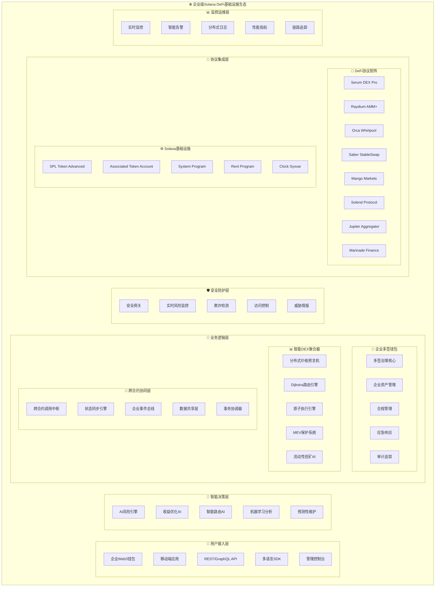
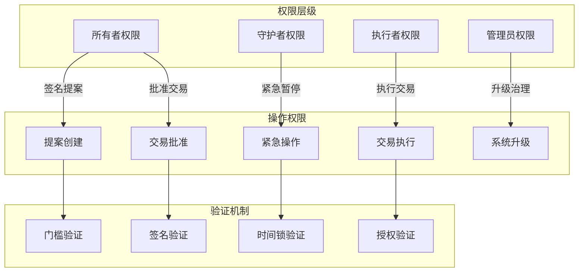
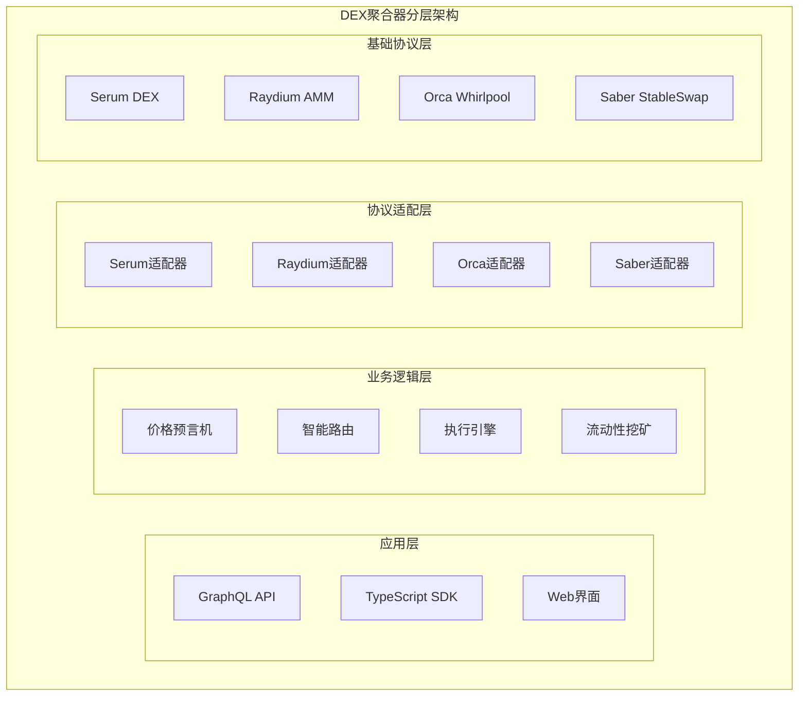
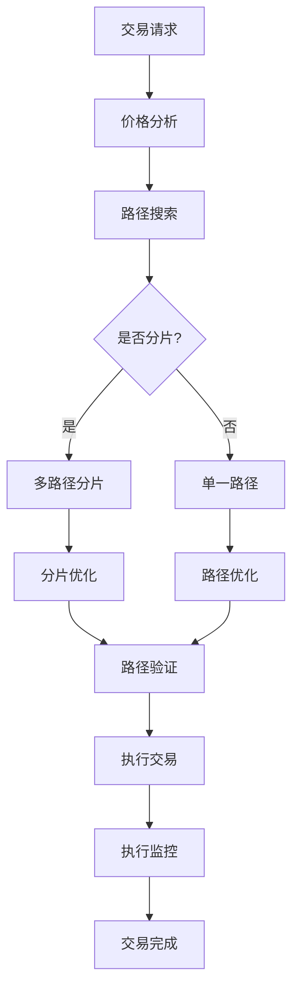
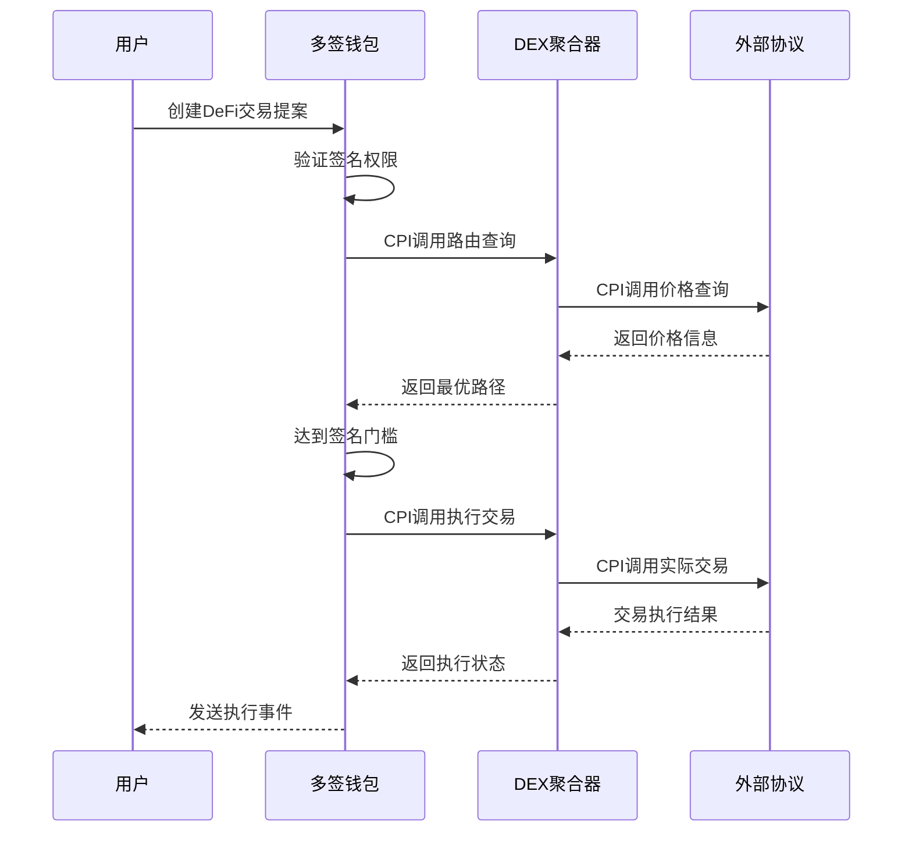
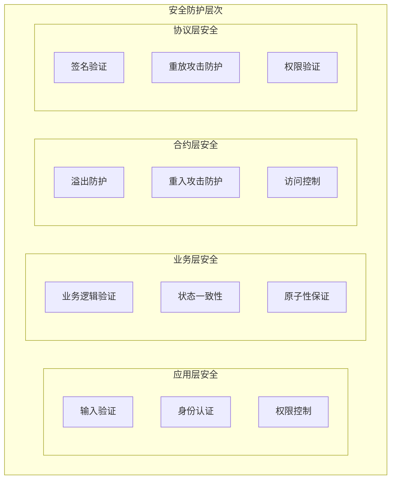
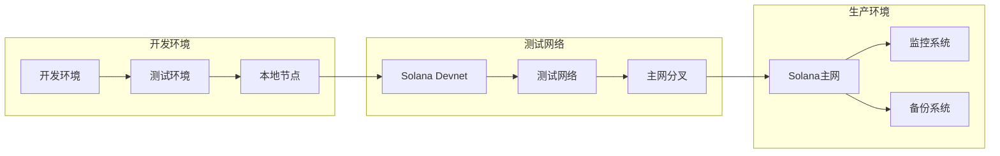
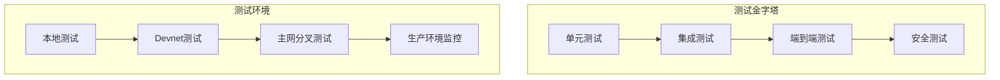

# 🏗️ Solana企业级DeFi基础设施架构设计

> **架构师**: Winston | **项目**: $955K企业级Solana DeFi基础设施 | **版本**: v2.0 (Enterprise)

---

## 📋 企业级项目概述

### **项目规模与定位**
- **投资规模**: $955K总预算，11人专业团队，12-16周开发周期
- **技术定位**: Solana生态企业级DeFi基础设施解决方案
- **商业目标**: 构建Solana原生的多签钱包+DEX聚合器协同生态
- **技术愿景**: 成为Solana DeFi的核心基础设施提供商

### **双项目协同战略架构**
本架构设计的核心是**双项目深度协同**，而非独立的两个合约：
- **Solana多签智能钱包** - 企业级资产管理和治理中枢
- **Solana DEX聚合器** - 智能交易执行和流动性优化引擎
- **统一基础设施** - 共享的安全、治理、监控和升级机制

### **企业级架构目标**
- 🏢 **企业级可靠性**: 99.99%可用性，零停机升级能力
- 🛡️ **金融级安全**: 多层次安全防护，通过专业审计
- ⚡ **极致性能**: CU优化≥30%，交易确认<2秒
- 🌐 **生态级集成**: 6+主流DeFi协议深度集成
- 🔄 **智能化运营**: AI驱动的收益优化和风险管理

---

## 🏛️ 核心架构原则

### **1. 企业级Solana原生架构**
```yaml
核心设计理念:
  - 极致性能优化: 基于Solana 65K TPS的并行计算架构设计
  - 成本效率最大化: 计算单元(CU)消耗优化≥30%，存储成本最小化
  - 原生生态集成: 深度集成SPL Token、Serum、Raydium等核心协议
  - 企业级扩展性: 支持$2M+资产管理和$10M+日交易量

技术实现策略:
  - Program Derived Address(PDA)确定性架构
  - Cross-Program Invocation(CPI)复杂调用链优化
  - 账户布局和指令优化的极致工程
  - Solana Runtime特性的深度利用
```

### **2. 金融级安全架构体系**
```yaml
多层次安全防护:
  - 智能合约层: 形式验证、静态分析、动态测试
  - 协议交互层: CPI安全边界、重入攻击防护、权限隔离
  - 业务逻辑层: 多签门槛、时间锁、紧急暂停机制
  - 运营监控层: 实时异常检测、自动化响应、审计追踪

企业级合规要求:
  - 零高危漏洞的专业安全审计
  - SOC2 Type II级别的运营安全
  - 多重灾备和业务连续性规划
  - 符合金融监管的治理机制
```

### **3. 智能化协同架构**
```yaml
双项目深度协同:
  - 统一用户身份和权限管理系统
  - 共享的价格数据和流动性信息
  - 跨合约状态同步和事务一致性
  - 统一的治理、升级和应急响应

AI驱动的智能决策:
  - 基于机器学习的收益优化算法
  - 智能风险评估和动态调整
  - 预测性维护和异常检测
  - 用户行为分析和个性化策略
```

### **4. 企业级运营架构**
```yaml
高可用性设计:
  - 99.99%服务可用性目标
  - 零停机升级和热部署能力
  - 多区域容灾和故障转移
  - 实时监控和自动化运维

可扩展性架构:
  - 模块化微服务架构设计
  - 水平扩展和负载均衡
  - 弹性资源分配和自动伸缩
  - 面向未来的技术栈选择
```

---

## 🏗️ 企业级系统架构

### **五层企业级架构体系**


### **企业级技术栈架构**
```yaml
🔧 核心开发技术栈:
  智能合约框架:
    - Anchor Framework v0.29+ (企业版)
    - Rust 2021 Edition + 企业级工具链
    - anchor-lang, anchor-spl, anchor-syn
    - solana-program v1.16+ (高性能版本)
  
  测试与质量保证:
    - anchor-test + 企业级测试套件
    - solana-test-validator + 性能测试
    - 形式验证工具 (TLA+, Dafny)
    - 静态分析工具 (Clippy++, Slither)
    - 模糊测试框架 (Echidna, Foundry)

🌐 协议集成矩阵:
  核心DeFi协议 (Tier 1):
    - Serum DEX v4 + OrderBook API
    - Raydium AMM v2 + CLMM
    - Orca Whirlpool + 集中流动性
    - Jupiter Aggregator v6 API
    
  流动性和收益协议 (Tier 2):
    - Saber StableSwap + Quarry Mining
    - Mango Markets v4 + 杠杆交易
    - Solend v2 + 动态利率
    - Marinade + 流动性质押
    
  基础设施协议 (Foundation):
    - Wormhole + 跨链桥接
    - Pyth Network + 价格数据
    - Metaplex + NFT标准
    - Clockwork + 自动化

🛠️ 企业级开发工具链:
  开发环境:
    - Solana CLI v1.16+ + 企业扩展
    - Anchor CLI + 自定义插件
    - Metaboss + NFT工具
    - SPL Token CLI + 批量操作
  
  IDE和调试:
    - rust-analyzer + Solana插件
    - Cursor + AI辅助编程
    - Solana Explorer + 交易分析
    - 自定义调试器和性能分析器
  
  部署和运维:
    - Docker + Kubernetes集群
    - Solana Validators集群管理
    - RPC Load Balancer
    - 企业级监控栈 (Prometheus+Grafana)

🚀 性能和可扩展性:
  计算优化:
    - 计算单元(CU)≤200K per transaction
    - 指令大小≤1232字节优化
    - 并行执行友好设计
    - 热路径算法优化
  
  存储优化:
    - 账户大小最小化设计
    - 租金豁免策略优化
    - 数据压缩和归档
    - 状态管理优化
  
  网络优化:
    - RPC节点负载均衡
    - 交易优先级优化
    - WebSocket实时更新
    - CDN加速和缓存
```

### **企业级安全架构矩阵**
```yaml
🛡️ 多层次安全防护体系:
  L1 - 智能合约安全:
    - 形式验证 + 数学证明
    - 静态分析 + 动态测试
    - 模糊测试 + 边界测试
    - 专业安全审计 (3轮+)
  
  L2 - 协议交互安全:
    - CPI调用边界验证
    - 权限隔离和最小化
    - 重入攻击防护
    - 状态一致性检查
  
  L3 - 业务逻辑安全:
    - 多重签名门槛设计
    - 时间锁和延迟执行
    - 紧急暂停机制
    - 治理攻击防护
  
  L4 - 运营安全:
    - 实时异常检测
    - 自动化响应系统
    - 审计日志和合规
    - 灾备和恢复

🔍 企业级监控体系:
  实时监控指标:
    - 交易成功率 ≥ 99.9%
    - 响应时间 ≤ 100ms P95
    - 系统可用性 ≥ 99.99%
    - 资金安全性 = 100%
  
  智能告警系统:
    - 异常交易检测
    - 大额资金流动告警
    - 权限变更通知
    - 性能指标异常

💼 企业级合规框架:
  合规要求:
    - SOC 2 Type II认证
    - 反洗钱(AML)检查
    - 了解客户(KYC)集成
    - 监管报告自动化
  
  审计追踪:
    - 完整操作日志记录
    - 权限使用追踪
    - 资金流向分析
    - 合规性验证
```

---

## 🔐 多签智能钱包合约架构

### **核心程序结构**
```rust
// 程序ID和模块组织
#[program]
pub mod multisig_wallet {
    // 核心指令模块
    pub mod instructions;
    // 状态管理模块  
    pub mod state;
    // 错误定义模块
    pub mod error;
    // 事件定义模块
    pub mod events;
    // 工具函数模块
    pub mod utils;
}
```

### **账户架构设计**
```mermaid
classDiagram
    class MultisigWallet {
        +Vec~Pubkey~ owners
        +u8 threshold
        +u64 nonce
        +u64 transaction_count
        +initialize()
        +add_owner()
        +remove_owner()
        +change_threshold()
    }
    
    class Transaction {
        +Pubkey wallet
        +Vec~u8~ instruction_data
        +Vec~AccountMeta~ accounts
        +Vec~bool~ signers
        +bool executed
        +i64 created_at
        +i64 expires_at
        +propose()
        +approve()
        +execute()
        +cancel()
    }
    
    class TokenAccount {
        +Pubkey mint
        +u64 amount
        +transfer()
        +batch_transfer()
        +create_ata()
    }
    
    class TimelockConfig {
        +i64 delay
        +Pubkey admin
        +Option~Pubkey~ pending_admin
        +queue_transaction()
        +execute_transaction()
        +cancel_transaction()
    }
    
    MultisigWallet ||--o{ Transaction : "1:N"
    MultisigWallet ||--o{ TokenAccount : "1:N"
    MultisigWallet ||--|| TimelockConfig : "1:1"
```

### **状态管理架构**
```yaml
状态设计原则:
  最小化存储: 使用紧凑的数据结构，减少账户大小
  原子操作: 确保状态变更的原子性和一致性
  版本控制: 支持状态结构的平滑升级
  索引优化: 高效的查询和状态访问模式

账户分类:
  主账户: MultisigWallet - 钱包核心配置和所有者信息
  交易账户: Transaction - 提案交易的详细信息和签名状态  
  代币账户: Associated Token Accounts - SPL代币余额管理
  配置账户: TimelockConfig, GovernanceConfig - 治理和安全配置
```

### **权限控制架构**


---

## 🧠 高级算法架构设计

### **Dijkstra智能路由引擎架构**
```yaml
算法复杂度: O((V + E) log V) - 企业级优化版本
目标: 在复杂的多DEX网络中找到成本最优的交易路径

核心数据结构:
  图论模型:
    - 顶点(Vertices): 所有支持的代币 (200+ tokens)
    - 边(Edges): DEX交易对和流动性池 (1000+ pairs)
    - 权重(Weights): 综合成本函数 (价格影响+费用+滑点+Gas)
  
  优先队列优化:
    - 基于Fibonacci堆的优化实现
    - 动态权重更新和路径重计算
    - 内存池化和缓存优化
    - 并行路径搜索算法

高级路径策略:
  多路径分片算法:
    - 大额交易自动分片到多个DEX
    - 最优分片比例动态计算
    - 并行执行和原子性保证
    - 失败回滚和重试机制
  
  时间窗口优化:
    - 基于历史数据的最优执行时间
    - 网络拥堵程度的路径调整
    - 优先级费用的动态优化
    - MEV攻击窗口的规避策略

实现架构:
  ```rust
  #[derive(Clone)]
  pub struct AdvancedRoutingEngine {
      graph: DynamicLiquidityGraph,
      pathfinder: OptimizedDijkstra,
      splitter: TransactionSplitter,
      executor: AtomicExecutor,
      mev_guardian: MEVProtectionSystem,
  }
  
  impl AdvancedRoutingEngine {
      pub async fn find_optimal_route(
          &self,
          input: TokenAmount,
          output: TokenMint,
          constraints: RouteConstraints,
      ) -> Result<OptimalRoute> {
          // 1. 构建动态流动性图
          let graph = self.build_dynamic_graph().await?;
          
          // 2. 执行优化的Dijkstra搜索
          let paths = self.pathfinder.search_multi_path(
              &graph, input, output, constraints
          ).await?;
          
          // 3. 评估和选择最优路径
          let optimal = self.evaluate_paths(paths).await?;
          
          // 4. MEV保护验证
          self.mev_guardian.validate_route(&optimal).await?;
          
          Ok(optimal)
      }
  }
  ```
```

### **AI驱动收益优化引擎**
```yaml
机器学习架构: 深度强化学习 + 在线学习
目标: 动态优化用户资产配置，最大化风险调整后收益

核心算法模型:
  多臂老虎机模型:
    - Upper Confidence Bound (UCB) 算法
    - Thompson Sampling for exploration
    - 动态奖励函数设计
    - 在线学习和模型更新
  
  深度Q网络(DQN):
    - 状态空间: 市场状态+用户偏好+协议状态
    - 动作空间: 资产配置策略+再平衡决策
    - 奖励函数: 收益率+风险调整+费用成本
    - 经验回放和目标网络

预测模型集成:
  时间序列预测:
    - LSTM网络预测价格趋势
    - ARIMA模型预测波动率
    - Prophet模型预测季节性
    - 集成学习提升预测精度
  
  风险模型:
    - VaR (Value at Risk) 计算
    - 无常损失预测模型
    - 相关性矩阵动态更新
    - 压力测试和情景分析

实现架构:
  ```rust
  #[derive(Clone)]
  pub struct AIYieldOptimizer {
      models: ModelEnsemble,
      strategy_engine: StrategyEngine,
      risk_manager: RiskManager,
      backtester: BacktestEngine,
  }
  
  pub struct YieldStrategy {
      allocation: HashMap<Protocol, f64>,
      rebalance_triggers: Vec<RebalanceTrigger>,
      risk_limits: RiskLimits,
      expected_apy: f64,
      confidence_interval: (f64, f64),
  }
  ```
```

### **MEV保护系统架构**
```yaml
威胁模型: 前置运行、夹击攻击、时间强盗攻击
防护策略: 多层次防护 + 主动检测 + 被动保护

核心防护机制:
  时序保护层:
    - 交易时间戳混淆
    - 随机延迟注入
    - 批量交易提交
    - 优先级费用动态调整
  
  私有内存池:
    - 与Flashbots类似的私有执行环境
    - MEV-resistant交易排序
    - 公平排序协议实现
    - 零知识证明验证
  
  主动检测系统:
    - 实时MEV机会检测
    - 攻击模式识别
    - 异常交易行为分析
    - 自动防护策略触发

高级保护策略:
  经济激励设计:
    - MEV收益的公平分配
    - 保护费用的动态定价
    - 用户损失的补偿机制
    - Validator激励对齐
  
  密码学保护:
    - 承诺-揭示方案 (Commit-Reveal)
    - 零知识证明的交易隐私
    - 时间锁加密 (Timelock Encryption)
    - 门限签名的分布式决策

实现架构:
  ```rust
  #[derive(Clone)]
  pub struct MEVProtectionSystem {
      detector: MEVDetector,
      guardian: MEVGuardian,
      compensator: LossCompensator,
      sequencer: FairSequencer,
  }
  
  pub enum MEVAttackType {
      Frontrunning { victim_tx: Hash, attacker_tx: Hash },
      Sandwiching { front_tx: Hash, back_tx: Hash, victim_tx: Hash },
      Backrunning { trigger_tx: Hash, exploit_tx: Hash },
      TimeRelatedAttack { timing_constraint: TimeConstraint },
  }
  
  impl MEVProtectionSystem {
      pub async fn protect_transaction(
          &self,
          tx: &Transaction,
          context: &MarketContext,
      ) -> Result<ProtectedTransaction> {
          // 1. MEV威胁检测
          let threats = self.detector.analyze_threats(tx, context).await?;
          
          // 2. 防护策略选择
          let protection = self.guardian.select_protection(&threats).await?;
          
          // 3. 应用保护机制
          let protected_tx = self.apply_protection(tx, protection).await?;
          
          // 4. 损失补偿预留
          self.compensator.reserve_compensation(&protected_tx).await?;
          
          Ok(protected_tx)
      }
  }
  ```
```

### **企业级风险管理引擎**
```yaml
风险类型: 市场风险、信用风险、流动性风险、操作风险、系统风险
管理策略: 实时监控 + 动态调整 + 自动化响应

风险度量模型:
  VaR模型矩阵:
    - 参数法VaR (Delta-Normal)
    - 历史模拟法VaR
    - 蒙特卡洛模拟VaR
    - 极值理论(EVT)建模
  
  压力测试框架:
    - 历史情景重现
    - 假设情景测试
    - 相关性破裂测试
    - 极端市场条件模拟

动态风险管理:
  实时风险监控:
    - 持仓集中度监控
    - 相关性风险监控
    - 流动性风险评估
    - 对手方风险评估
  
  自动化风险控制:
    - 动态止损机制
    - 仓位限制管理
    - 流动性阈值控制
    - 紧急平仓程序

实现架构:
  ```rust
  #[derive(Clone)]
  pub struct EnterpriseRiskEngine {
      var_calculator: VaRCalculator,
      stress_tester: StressTester,
      monitor: RealTimeMonitor,
      controller: AutomatedController,
  }
  
  pub struct RiskMetrics {
      portfolio_var_1d: f64,    // 1日VaR
      portfolio_var_10d: f64,   // 10日VaR
      expected_shortfall: f64,   // 条件VaR
      max_drawdown: f64,         // 最大回撤
      sharpe_ratio: f64,         // 夏普比率
      correlation_risk: f64,     // 相关性风险
      liquidity_score: f64,      // 流动性评分
  }
  ```
```

## 📊 企业级DEX聚合器架构

### **核心程序结构**
```rust
#[program]
pub mod dex_aggregator {
    // 价格查询模块
    pub mod price_oracle;
    // 路由算法模块
    pub mod routing_engine;
    // 执行引擎模块
    pub mod execution_engine;
    // 协议适配器模块
    pub mod protocol_adapters;
    // 流动性挖矿模块
    pub mod liquidity_farming;
    // 风险管理模块
    pub mod risk_management;
}
```

### **分层架构设计**


### **价格聚合架构**
```yaml
价格聚合设计:
  数据源管理:
    - 多DEX价格实时监控
    - 价格数据标准化处理
    - 异常价格检测和过滤
    - 流动性深度评估
    
  聚合算法:
    - 加权平均价格计算
    - 流动性调整价格
    - 价格影响建模
    - 滑点预测算法
    
  缓存策略:
    - 价格数据智能缓存
    - 过期策略和更新机制
    - 高频访问优化
    - 存储成本控制
```

### **智能路由引擎**


### **协议集成架构**
```yaml
适配器模式设计:
  统一接口:
    - 标准化的DEX操作接口
    - 一致的错误处理机制
    - 统一的事件发布格式
    - 标准化的参数验证
    
  协议适配:
    - Serum订单簿适配器
    - Raydium AMM适配器  
    - Orca集中流动性适配器
    - Saber稳定币适配器
    
  版本管理:
    - 协议版本兼容处理
    - 升级路径平滑迁移
    - 废弃协议优雅退出
    - 新协议快速集成
```

---

## 🔄 跨合约交互架构

### **CPI调用架构**


### **数据流架构**
```yaml
数据流设计:
  状态同步:
    - 账户状态实时同步
    - 事件驱动状态更新
    - 一致性检查机制
    - 冲突解决策略
    
  数据共享:
    - 价格数据共享机制
    - 流动性信息传递
    - 交易历史聚合
    - 风险指标同步
    
  错误传播:
    - 层级错误处理
    - 错误上下文保留
    - 失败回滚机制
    - 用户友好错误提示
```

### **权限委托机制**
```rust
// 权限委托设计示例
#[account]
pub struct Delegation {
    pub delegator: Pubkey,      // 委托者
    pub delegate: Pubkey,       // 被委托者
    pub permissions: u64,       // 权限位图
    pub expires_at: i64,        // 过期时间
    pub nonce: u64,            // 防重放
}

// 跨合约权限验证
pub fn verify_cross_contract_authority(
    delegator: &Pubkey,
    delegate: &Pubkey,
    required_permission: Permission,
) -> Result<()> {
    // 验证委托关系和权限
}
```

---

## 🛡️ 安全架构设计

### **安全防护体系**


### **威胁模型和防护**
```yaml
主要威胁和防护措施:
  
  重放攻击:
    威胁: 恶意重复执行已签名交易
    防护: nonce机制 + 时间戳验证 + 唯一性检查
    
  权限提升:
    威胁: 非授权用户获得高级权限
    防护: 严格权限验证 + 最小权限原则 + 审计日志
    
  整数溢出:
    威胁: 数值计算溢出导致异常行为
    防护: checked_math + 边界检查 + 类型安全
    
  重入攻击:
    威胁: 外部调用导致的状态不一致
    防护: checks-effects-interactions模式 + 状态锁
    
  MEV攻击:
    威胁: 抢跑和三明治攻击
    防护: 时序保护 + 私有内存池 + 公平排序
```

### **审计和监控架构**
```yaml
安全监控体系:
  
  实时监控:
    - 异常交易检测
    - 权限变更监控
    - 大额资金流动告警
    - 系统状态健康检查
    
  审计机制:
    - 完整的操作日志记录
    - 状态变更追踪
    - 权限使用审计
    - 异常行为分析
    
  应急响应:
    - 紧急暂停机制
    - 快速响应流程
    - 资产保护措施
    - 恢复操作程序
```

---

## 🚀 部署和升级架构

### **部署架构策略**


### **可升级程序设计**
```yaml
升级架构设计:
  
  程序升级机制:
    - 可升级程序设计模式
    - 数据账户和程序账户分离
    - 平滑的状态迁移机制
    - 回滚和恢复策略
    
  治理驱动升级:
    - 提案创建和投票机制
    - 社区治理参与
    - 时间锁保护机制
    - 透明的升级过程
    
  兼容性管理:
    - 向前兼容性保证
    - 废弃功能优雅退出
    - API版本管理
    - 客户端适配支持
```

### **环境管理架构**
```yaml
多环境配置:
  
  配置管理:
    - 环境特定配置分离
    - 敏感信息安全管理
    - 配置版本控制
    - 动态配置更新
    
  数据管理:
    - 测试数据隔离
    - 生产数据保护
    - 数据备份策略
    - 恢复测试验证
    
  访问控制:
    - 环境访问权限控制
    - 操作审计和记录
    - 安全密钥管理
    - 网络访问限制
```

---

## ⚡ 性能优化架构

### **计算单元优化**
```yaml
CU优化策略:
  
  指令优化:
    - 单个指令CU消耗分析
    - 复杂操作分解策略
    - 并行执行友好设计
    - 热路径优化
    
  账户优化:
    - 最小化账户数量
    - 账户访问模式优化
    - 数据结构紧凑设计
    - 缓存友好布局
    
  算法优化:
    - 高效数学计算
    - 查找算法优化
    - 内存使用优化
    - 计算复杂度控制
```

### **存储优化架构**
```yaml
存储成本优化:
  
  账户设计:
    - 最小可行账户大小
    - 数据压缩技术应用
    - 可选字段设计
    - 租金豁免优化
    
  数据管理:
    - 历史数据归档策略
    - 临时数据清理机制
    - 状态压缩技术
    - 链下存储集成
    
  访问模式:
    - 热数据优先加载
    - 冷数据延迟加载
    - 预测性缓存
    - 智能预取策略
```

---

## 🧪 测试和质量保证架构

### **测试架构策略**


### **质量保证体系**
```yaml
质量保证措施:
  
  代码质量:
    - Rust编译器检查
    - Clippy静态分析
    - 代码格式化标准
    - 文档完整性检查
    
  功能质量:
    - 功能测试覆盖率>85%
    - 边界条件测试
    - 错误路径测试
    - 性能基准测试
    
  安全质量:
    - 自动化安全扫描
    - 专业安全审计
    - 渗透测试
    - 漏洞披露机制
```

---

## 📋 架构决策记录

### **关键技术选择**
| 决策点 | 选择 | 理由 | 权衡 |
|--------|------|------|------|
| 开发框架 | Anchor Framework | 类型安全、开发效率高、生态成熟 | 学习曲线、框架依赖 |
| 账户模型 | PDA + Associated Accounts | 确定性地址、gas优化 | 复杂性增加 |
| 升级机制 | 可升级程序 | 灵活性、可维护性 | 中心化风险 |
| 错误处理 | Result<T> + 自定义错误 | 类型安全、错误透明 | 代码复杂度 |
| 状态管理 | 最小化状态设计 | 成本优化、性能提升 | 查询复杂度 |

### **架构风险和缓解**
```yaml
主要架构风险:
  
  复杂性风险:
    风险: 过度设计导致开发困难
    缓解: 分阶段实现、MVP优先、持续重构
    
  性能风险:
    风险: CU消耗超出限制
    缓解: 性能测试、优化策略、分拆指令
    
  安全风险:
    风险: 智能合约漏洞
    缓解: 多轮审计、形式验证、渐进部署
    
  集成风险:
    风险: 外部协议变更影响
    缓解: 适配器模式、版本管理、监控告警
```

---

## 🎯 实施路线图

### **开发优先级**
```yaml
Phase 1 - 基础设施 (Week 1-4):
  - [ ] Anchor项目框架搭建
  - [ ] 核心账户结构设计
  - [ ] 基础安全机制实现
  - [ ] 测试框架建立

Phase 2 - 核心功能 (Week 5-10):
  - [ ] 多签钱包核心逻辑
  - [ ] DEX聚合器价格系统
  - [ ] SPL代币集成
  - [ ] 基础路由算法

Phase 3 - 高级功能 (Week 11-14):
  - [ ] DeFi协议集成
  - [ ] 智能路由优化
  - [ ] 流动性挖矿功能
  - [ ] 安全治理机制

Phase 4 - 部署上线 (Week 15-16):
  - [ ] 性能优化调优
  - [ ] 安全审计修复
  - [ ] Devnet部署验证
  - [ ] 文档和SDK完善
```

### **成功指标**
```yaml
技术指标:
  - 测试覆盖率 ≥ 85%
  - 安全审计零高危漏洞
  - CU优化效果 ≥ 30%
  - 交易成功率 ≥ 99%

业务指标:
  - 核心功能100%完成
  - 主流协议集成 ≥ 8个
  - Devnet部署成功
  - 用户体验评分 ≥ 4.5/5
```

---

**文档信息**
- **创建日期**: 2024年1月
- **架构师**: Winston (Holistic System Architect)
- **技术负责人**: Rust智能合约团队
- **审核人**: Solana技术专家 + DeFi架构师

*🏗️ 这份架构设计文档为Solana DeFi智能合约项目提供了全面的技术架构指导，确保我们构建出高性能、安全可靠、可扩展的企业级DeFi基础设施！*

